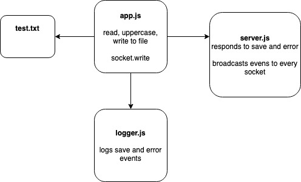

#  LAB

## Lab-17-tcp

### Author: Bonnie Wang

### Links and Resources

- [submission PR](http://xyz.com)
- [back-end](http://xyz.com) (when applicable)

#### Documentation

- [api docs](http://xyz.com) (API servers)
- [jsdoc](http://xyz.com) (Server assignments)
- [styleguide](http://xyz.com) (React assignments)

### Modules

#### `app.js -> reads and writes file to all caps, sends data to server`

#### `logger.js -> logs save and error events`

#### `server.js -> listens for connections`

### Setup

#### `.env` requirements

- `PORT` - Port Number

#### Running the app

- run in this order
- `node server.js`
- `node logger.js`
- `node app.js./files/test.txt`

- Modifies file in all caps

#### UML

